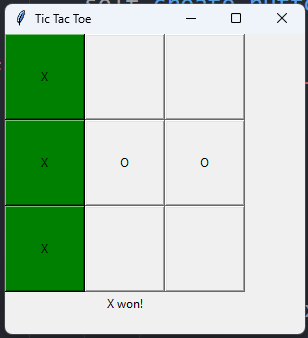

# TicTacPy - A TicTacToe game written in Python

## Description

This game is a simple TicTacToe game written in Python. Its game made in tkinter, and it is played by two players. The game is played on a 3x3 grid. The first player to get three of their marks in a row (up, down, across, or diagonally) is the winner. If the grid is filled and neither player has won, the game is a draw.

## Installation

- Clone the repository
- Run the main.py file (assuming tkinter is installed)

## Usage

- Run the main.py file
- Click on the buttons to place your mark
- The game will automatically detect if you won or not

## Contributing

Pull requests are welcome. For major changes, please open an issue first to discuss what you would like to change.

## License

### [The MIT License](https://choosealicense.com/licenses/mit/)

## Screenshots

